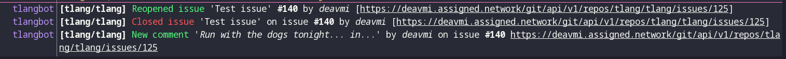

gitea-irc-bot
=============

  




## Usage

### Webhook setup

You should setup the following webhooks on your Gitea instance:

1. `HOSTNAME:PORT/issue`
    * MIME type: `application/json`
    * Method: `POST`
    * Enable "Custom Events":
        * `Issues`
        * `Issue Labeled`
        * `Issue Comment`
        * `Issue Milestoned`
        * `Issue Assigned`
2. `HOSTNAME:PORT/commit`
    * MIME type: `application/json`
    * Method: `POST`
    * Enable "Custom Events":
        * `Push`

### Building

Simply clone the repository with:

```bash
git clone https://github.com/deavmi/gitea-irc-bot
```

Then run the following command to build the library:

```bash
cd gitea-irc-bot
dub build
```

### Configuring

You should have a `config.json` in the repository. You can now customize this to tweak settings for the bot.

An example configuration file can look as follows:

```json
{
    "irc" : {
        "host": "irc.freenode.net",
        "port": 6667,
        "nickname": "tlangbot",
        "realname": "TLang Development Bot",
        "username": "tbot",
        "channels": {
            "tlang" : "#tlang",
            "repoName" : "#destinationChannel"
        }
    },
    "ntfy": {
        "endpoint": "http://ntfy.sh",
        "topic": "myTestFr"
    }
}
```

**Note:** `gitea-irc-bot` will **always** look for a configuration file named `config.json` in the _current working directory_

#### Environment variables

An example configuration file appears as follows:

```bash
# Webhook configuration
export WEBHOOK__BINDADDRESS="0.0.0.0"
export WEBHOOK__PORT=8080

# IRC server
export IRC__HOST="pinewood.irc.bnet.eu.org"
export IRC__PORT=6667
export IRC__NICKNAME="GiteaBot"
export IRC__REALNAME="A Gitea bot written by deavmi"
export IRC__CHANNELS="tlang:#tlang;thing2:#thing2Chan"
export IRC__USERNAME="tbot"
```

**Note:** Specifying an environment variable will override the respective configuration parameter **entirely**.

## License

AGPL 3.0
